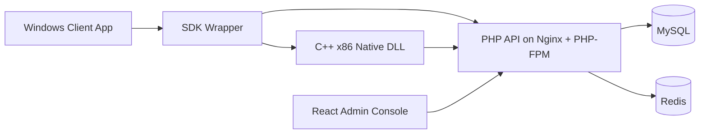

# System Design

## Runtime Topology

## Core Principles

- Single platform, multi-product management
- Strict machine binding with per-product policy isolation
- Server-authoritative trial expiration
- Short-window presence tracking for online counts
- Risk engine and approval workflow integrated into every binding lifecycle

## Modules

- `Product`: product registry and product-scoped security profile
- `License`: card keys, licenses, device bindings, and trial sessions
- `Fingerprint`: normalized machine snapshot and encrypted storage
- `Risk`: rules, events, and blocking decisions
- `Approval`: manual review queue and decisions
- `Stats`: platform overview, product overview, daily trend aggregation
- `Admin`: local accounts, MFA hook points, role scopes
- `Audit`: immutable operator and client action logs

